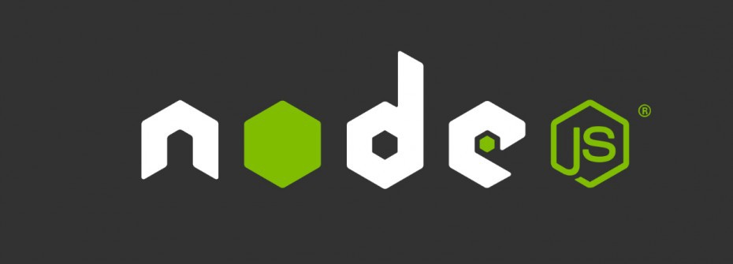

<!-- markdownlint-disable MD033 -->

# Ignite Trilha NodeJS - Clean DDD

   

  
  
  
  

## Sobre o Projeto

Esse projeto será dividido em duas partes. O primeiro módulo será focado na construção da camada de Domínio de uma API de um fórum, seguindo os conceitos de DDD e Clean Architecture. No módulo seguinte, será conectado essa camada de domínio à camada de infraestrutura utilizando o Framework NestJS

### DDD no Nodejs

Nesse módulo você irá aprender os fundamentos de Domain-Driven Design e Clean Architecture na construção de uma API REST para um fórum. Você aprenderá a desenhar a arquitetura da aplicação utilizando conceitos de DDD, criar Value Objects e Relacionamentos, lidar com erros de forma funcional, desenvolver casos de uso, testes unitários, aplicar Subdomínios e Domain Events.

> [Comandos](./.github/docs/a_commands.md) de terminal utilizados neste projeto
>
> [Notas](./.github/docs/b_notes.md) sobre conceitos e explicações
>
> Análise interpretativa e lógica do [código](./.github/docs/c_code-analysis.md)
>
> Perguntas e Respostas dos [quizzes](./.github/docs/d_quizzes.md).

## Tecnologias

- [`NodeJs`](https://nodejs.org/)
- [`typescript`](https://www.typescriptlang.org/)
- [`vitest`](https://vitest.dev/)

## Licença

Distribuído sob a licença *MIT*. Veja [LICENSE](LICENSE) para mais informações.

---

<h5 align="center">
  2023 - <a href="https://github.com/mgckaled">Marcel Kaled</a>
</h5>
